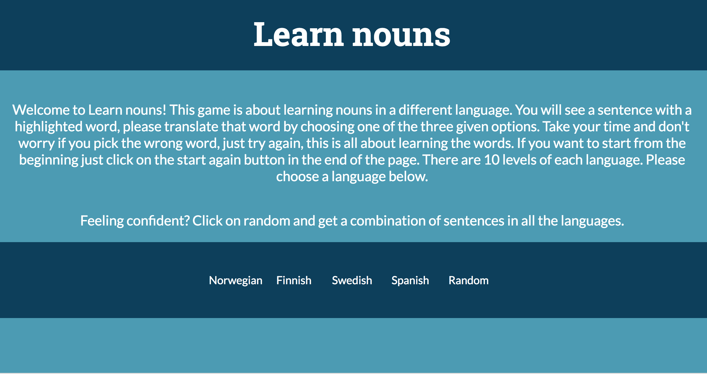
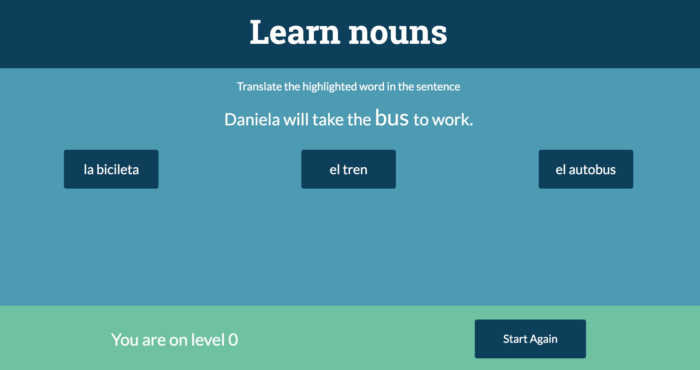

.

# LEARNING NOUNS

## Description
As a first project on GA I made an educational game for learning nouns in Spanish, Swedish, Norwegian or Finnish. Each language has five stages with a sentence and word you find the right translation for. There is also an random option that will generate any sentence of any of the four languages. This is inspired by one of my favourite apps Duolingo.

<figure>
  
  <figcaption><a href="https://mighty-forest-74507.herokuapp.com/" title="Learn Nouns">The start of the game with the instructions and the language options</a>.</figcaption>
</figure>

## Project Brief

Your app must:

* Render a game in the browser
* Switch turns between two players
* Design logic for winning & visually display which player won
* Include separate HTML / CSS / JavaScript files
* Stick with KISS (Keep It Simple Stupid) and DRY (Don't Repeat Yourself) principles
* Use Javascript or jQuery for DOM manipulation
* Deploy your game online, where the rest of the world can access it
* Use semantic markup for HTML and CSS (adhere to best practices)

Necessary Deliverables:

* A working game, built by you, hosted somewhere on the internet
* A link to your hosted working game in the URL section of your Github repo
* A git repository hosted on Github, with a link to your hosted game, and frequent commits dating back to the very beginning of the project
* A readme.md file with explanations of the technologies used, the approach taken, installation instructions, unsolved problems, etc.

<figure>
  
  <figcaption><a href="https://mighty-forest-74507.herokuapp.com/" title="LEARN NOUNS">My first project at GA: an educational game about learning nouns </a>.</figcaption>
</figure>

## Installation and setup

### Run Locally

- Download or clone the [Github repo](https://github.com/EvelinaKuu/wdi-first-project.git)
- Run `gulp` in the terminal to compile the source code and open in the browser

### View Online

- [View on Heroku](https://mighty-forest-74507.herokuapp.com/)
- [View on Github](https://github.com/EvelinaKuu/wdi-first-project.git)

### Technologies used

To create this project I used the following technologies:

- HTML5
- SCSS
- Javascript (ECMAScript 6)
- jQuery
- Atom
- GIMP
- Git
- Github
- Heroku

## The Approach taken

I started with wireframes to plan my project and went into detail in planning all the steps. As Learn nouns is an educational game I would keep in my during the planning that everything should support the users learning process.

## Challenges Faced

In terms of coding my biggest challenge was the random function also the layout and styling in CSS was a big challenge.

## To improve

In the future I would:

- Add levels and languages:
  *  At the moment the game has Spanish, Finnish, Swedish and Norwegian, each with 10 levels and 10 sentences to translate. I also added a random function which will randomly select a sentence of any of the languages ten times. For the purpose of learning more nouns and words in one language levels should be added. Also it would be beneficial to add a feature to explain the words, so when you move up a level, you would not only know the right option and it's meaning but the other's as well.

- Improve the code:
  * The code could be dryer and also the CSS stylesheet probably have some overlapping styling that are unnecessary.
